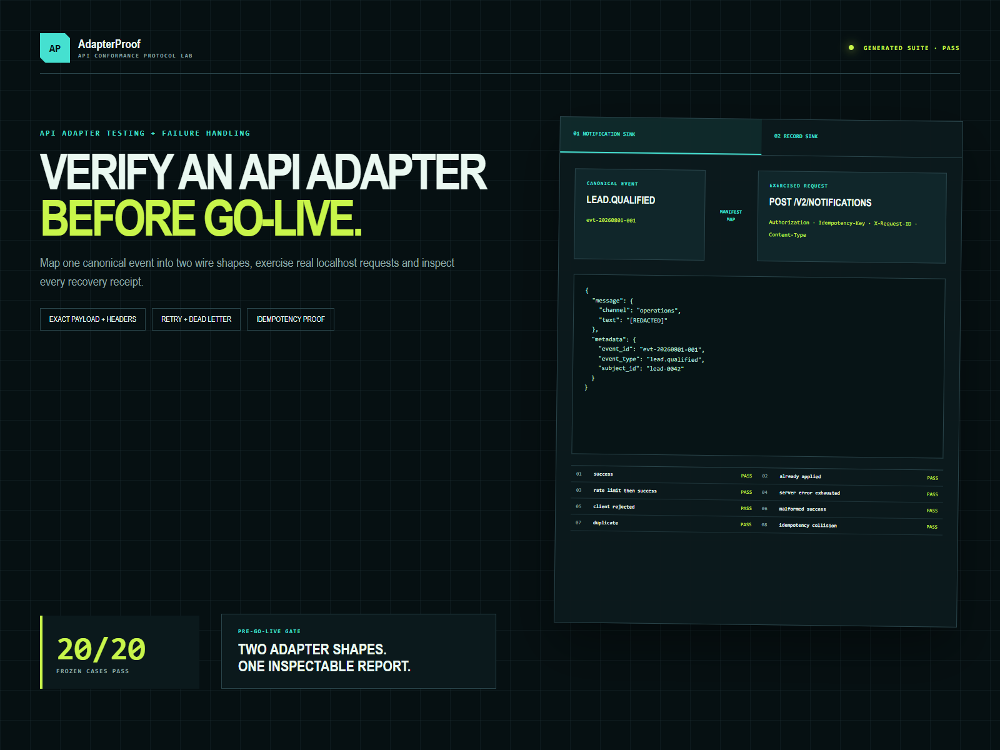
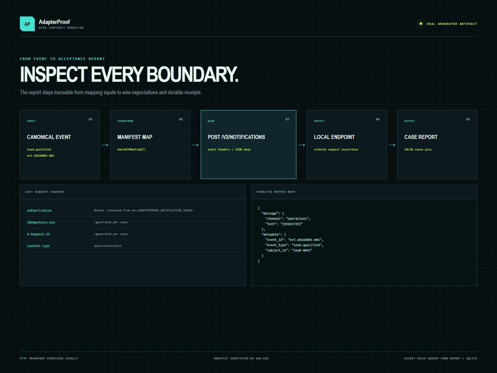

# AdapterProof

**Verification:** [claim-to-artifact map and rerun commands](https://sutasmantas.github.io/evidence/#adapterproof) · [machine-readable receipt](https://sutasmantas.github.io/evidence/receipt.json)

AdapterProof verifies a client-owned HTTP integration before live credentials
or go-live. A declarative manifest maps a canonical event into the provider
payload and defines referenced authentication, idempotency, and correlation
headers. The harness then sends real localhost HTTP requests through
DeliveryGuard and records a case-level conformance report.

The frozen suite covers two deliberately generic adapter shapes—record and
notification sinks—not named SaaS products. Each runs success, already-applied,
rate-limit recovery, exhausted server failure, permanent rejection, malformed
success, duplicate delivery, changed-payload idempotency collision refusal,
dead-letter replay, and missing-secret cases.



[Open the live conformance report](https://sutasmantas.github.io/api-adapter-conformance-harness/)

## Quickstart

```powershell
python -m venv .venv
.\.venv\Scripts\python.exe -m pip install vendor\deliveryguard-0.2.0-py3-none-any.whl
.\.venv\Scripts\python.exe -m pip install -e ".[test]"
.\.venv\Scripts\python.exe -m pytest tests\test_adapterproof.py -q
.\.venv\Scripts\adapterproof.exe run --output .evidence\report.json
```

The command must print `"gate": "PASS"` for both manifests. It can be rerun
against the same database directory without reusing an action because each
verification execution is separately scoped.

## Reusable OpenAPI verification

AdapterProof also exposes a pinned, schema-derived API gate that is consumed by
Ledger Lens and Relay through the same JSON contract and GitHub workflow. The
upstream Schemathesis implementation generates and checks the HTTP cases;
AdapterProof supplies the stable isolation, budget, receipt, and failure-
classification contract.

```powershell
.\.adapterproof-venv\Scripts\python.exe -m adapterproof openapi `
  --config adapterproof.openapi.json `
  --consumer-python .\.consumer-venv\Scripts\python.exe `
  --report-dir .evidence\openapi
```

The default gate passes only on `NO_FINDINGS`. A planted mutation may explicitly
use `--expect findings`; a timeout or schema-load failure can never count as a
successful detection. See [the reusable contract](docs/OPENAPI_CONTRACT.md) and
the consumer examples in Ledger Lens and Relay.

## Read-only report viewer

Generate the report, then open the local protocol-lab surface:

```powershell
.\.venv\Scripts\adapterproof.exe run --output docs\evidence\conformance-report.json
.\.venv\Scripts\adapterproof.exe view --report docs\evidence\conformance-report.json
```

Visit `http://127.0.0.1:8767`. The viewer reads the generated report directly;
it does not run a second test path or hard-code the pass count. It shows the
safe request-header contract, redacted mapped payload, manifest identity, and
receipt sequence for each frozen case.



## Manifest capabilities

The manifest supports:

- one HTTP endpoint path;
- an `env:` secret reference, header, and prefix;
- idempotency and correlation header names;
- bounded timeout;
- source-to-target dot-path mappings and JSON constants;
- required source paths and additional redacted field names.
